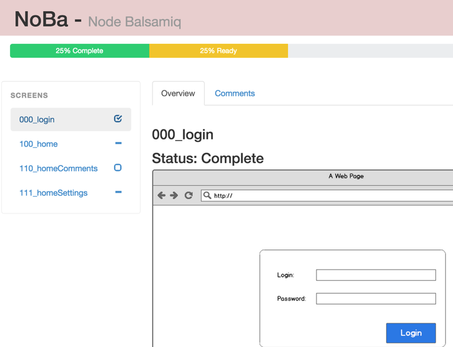

Node Balsamiq Tool
================

If you are using Basalmiq, you know that you must have one file per mockup screen. 
So you probably reach the point where you have tons of files. I needed a simple tool to quickly see my files and know:

- If a screen is considered complete or not

- Keep track of the comments

I tried to find an existing tool to do it, they are all very good, but i was not ready to put the price (monthly fee) in that.
And i am not very confident in putting my files in the could.
That's why i came with that simple tool:

This is a very early release, this tool was done as one of my '48h project hack' (just do something that works in 48h).
I will add features if i need more, i am sharing this here in case somebody have the same need. Please let me know what feature you would like to see, and,  better implement it yourself :) and share it back here.

# How It works

You just have to specify the path of your wireframes, and then to start the node server and open your browser.
The tool will read all your wires, and check if there is a markup starting with ##SOWT##. This is a markup containing various information that the server is able to parse.

# Status

The first information is the current status of the wireframe. It can be:
- 'Complete', that is done, and accepted by all stakeolders
- 'In Review', meaning ready to be reviewed, and waiting for stakeolders acceptance.
- 'In Progress', this screen is not yet finished.

This markup format is STATUS: 'Complete|In Review|Incomplete'

# Comments

If you want to add comments, you just need to edit the SOWT markup using this format:

    <Author>: <Description>, <status>

    status = [x]|[o]

    E.g: John: Sample comment, [x]

# How to install

Prerequisite: You will need to install NodeJs --> http://nodejs.org/

Just download this project and do this:

    npm install

And then setup you wireframe folder by editing the config.json file:
    {
    	"wiresPath" : "./wires",	
    	"mediaPaths" : "wires/export"
    }

Now, start the server:

	npm start 

And open your browser

    http://localhost:3000/
